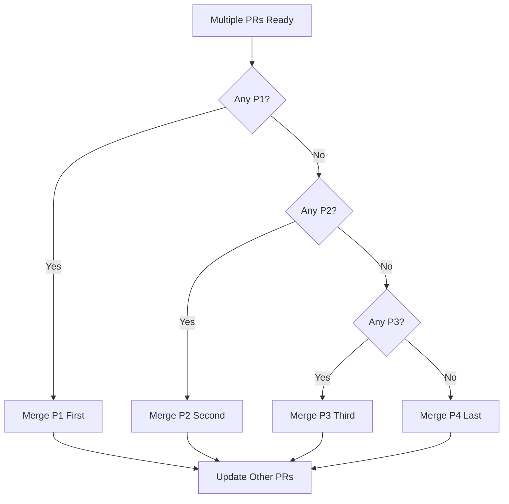

# PR Merge Priority Guide

This document helps coordinate merges when multiple PRs are open.

## Current Open PRs

Check the [open pull requests](../../../pulls) before starting new work.

## Priority Levels

### 🔴 Priority 1: Infrastructure & Security (Merge ASAP)
- Security vulnerabilities
- Critical bug fixes
- Database migrations
- Breaking dependency updates
- Infrastructure changes that other features depend on

**Examples**: Rate limiting, authentication fixes, database schema changes

### 🟡 Priority 2: Core Features (Merge Second)
- New user-facing features
- API endpoint changes
- Data model changes
- Integration with external services

**Examples**: New post types, user settings, notification system

### 🟢 Priority 3: Enhancements (Merge Third)
- UI/UX improvements
- Performance optimizations
- Code refactoring
- Non-breaking changes

**Examples**: Style updates, component reorganization, helper functions

### ⚪ Priority 4: Optional (Merge Last)
- Documentation
- Tests (without code changes)
- Experimental features
- Nice-to-have improvements

**Examples**: README updates, code comments, design explorations

---

## Before Creating a PR

1. **Check open PRs**: Look for overlapping changes
2. **Check priority**: Is your change urgent or can it wait?
3. **Coordinate**: Comment on related PRs about your plans
4. **Size**: Keep PRs small and focused

---

## Managing Conflicts

### If Your PR Has Conflicts

1. Update your branch:
   ```bash
   git checkout your-branch
   git fetch origin
   git merge origin/main
   ```

2. Resolve conflicts in your IDE

3. Test thoroughly:
   ```bash
   npm install
   npm run test -- --run
   npm run build
   ```

4. Push the resolution:
   ```bash
   git push origin your-branch
   ```

### If You're Blocked by Another PR

1. Comment on the blocking PR
2. Coordinate with the author
3. Consider if your changes can be split:
   - Independent parts → merge now
   - Dependent parts → wait for blocker

---

## Merge Order Strategy

When multiple PRs are ready:



---

## High-Risk Files

These files are frequently modified and cause conflicts:

### ⚠️ Core Files (Coordinate before editing)
- `server.ts` - Main backend (being refactored)
- `src/App.tsx` - Main frontend component
- `src/models/User.ts` - User data model
- `package.json` - Dependencies

### ✅ Safe Files (Less likely to conflict)
- New component files
- Test files
- CSS/style files
- Utility functions

---

## Labels

Use these labels on your PRs:

- `priority-high` - P1: Infrastructure/Security
- `priority-medium` - P2: Core features
- `priority-low` - P3: Enhancements
- `blocks-other-prs` - Other PRs depend on this
- `blocked-by-pr` - Waiting on another PR

---

## Need Help?

- Unsure about priority? Ask in the PR
- Complex conflicts? Request help from the original author
- Multiple dependencies? Consider an integration branch

See [MERGE_CONFLICT_RESOLUTION_GUIDE.md](../MERGE_CONFLICT_RESOLUTION_GUIDE.md) for detailed strategies.
